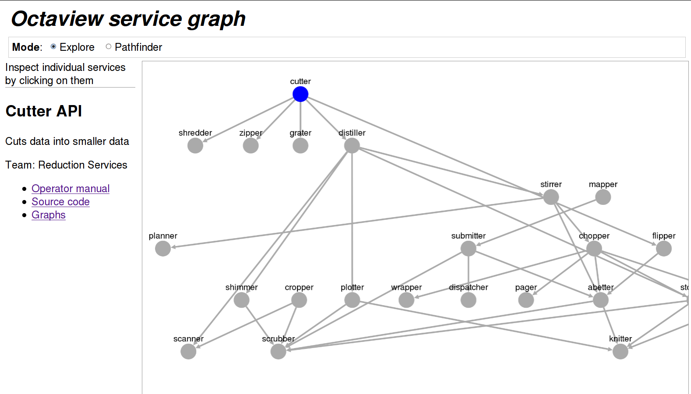
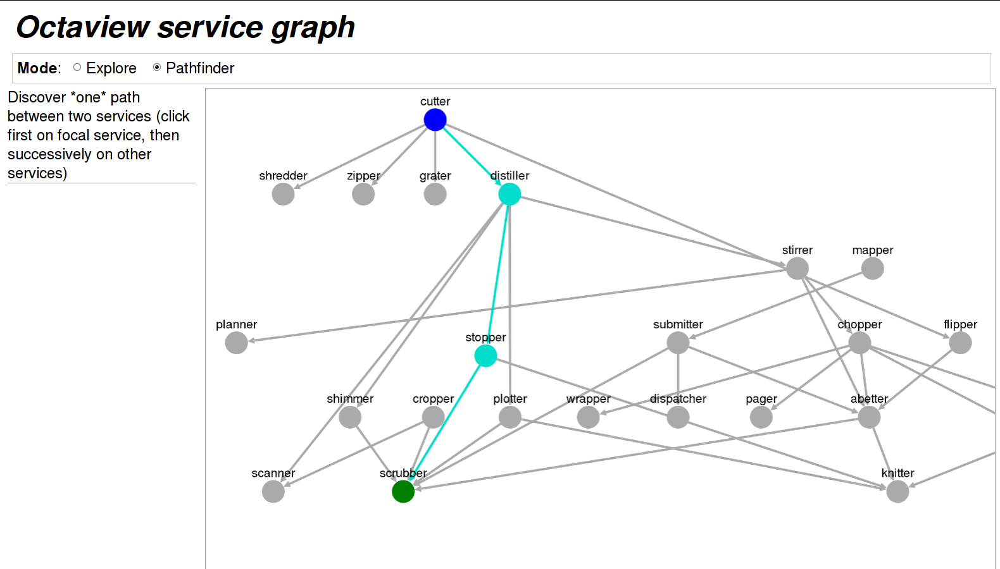

# octaview

Untangle your jungle of microservice dependencies. (Named for
[Marie Octavie Coudreau][wp-marie], who explored the Amazon jungle
from 1899 to 1906.)

[wp-marie]: https://en.wikipedia.org/wiki/Octavie_Coudreau

## Status

Work in progress.

- Describe your services as a collection of JSON files: ID, name,
  description, dependencies, and URLs
- Octaview serves a website with an interactive graph
- The graph shows directed dependencies between labeled services
- In **Explore** mode, clicking on a service shows its information in a
  sidebar
- In **Pathfinder** mode, clicking on two services will show the
  dependency chain from the first to the second

## Screenshots




## Demo

After installing the [Leiningen][lein] build tool for Clojure:

[lein]: https://leiningen.org/

```bash
lein run demo/settings.json
```

## Format and example

Each service descriptor is a JSON file in a directory. The JSON data
structure is:

- `id`: A short, readable, unique ID string made of `[a-zA-Z0-9_-]+`,
  conventionally used as the filename as well. This is the only
  required field.
- `name`: Name of the service
- `desc`: Longer description (no formatting provided)
- `attrs`: Map of additional machine-readable key-value
  pairs. Suggested keys:
    - `team`: Canonicalized name of the team that maintains this service
- `dependencies`: Array of dependency maps with the following structure:
    - `id`: ID of another service this one depends on
- `links`: Array of link maps providing more information about the
  service, with the following structure:
    - `type`: Type of link, one of `doc` (documentation, a catch-all
      category), `source` (source code), or `monitor` (dashboards,
      alerts, graphs).
    - `name`: Text of link
    - `url`: URL of link (required)

Silly example:

```json
{
  "id": "dnaas",
  "name": "/dev/null",
  "desc": "Hosted instance of /dev/null-as-a-service",
  "attrs": {"team": "Deletion"},
  "dependencies": [
    {
      "id": "delete-auditor"
    },
    {
      "id": "trashdb"
    },
    {
      "id": "zookeeper"
    }
  ],
  "links": [
    {
      "type": "doc",
      "name": "Operator manual",
      "url": "https://intranet.example.com/19856195"
    },
    {
      "type": "source",
      "url": "https://github.com/example/example"
    },
    {
      "type": "monitor",
      "name": "Graphs",
      "url": "https://example.datadoghq.com/dash/31337/thing"
    }
  ]
}
```

## TODO

Support the following interactions:

- "What is this service? Where can I find docs, source, monitoring?"
- "Show me only the things on the paths between A and B"
- "At a glance, are there any services with monitor alerts, and are
  they related?"

Represent and display the following types of information:

- Types of dependencies:
    - Direct call vs. communication through a queue (for the latter,
      is that a directed dependency? which direction?)
    - Data flow and freshness: Cached or not; read and/or write
    - Relationship with other dependencies: Calls made to serve
      inbound dependencies (request-path calls) vs. for maintaining
      service stability (e.g. signing keys)
    - Sync/async calls (async might include backfilling a cache, or
      fetching signing keys)
    - Format: HTTP, database connections, etc.
    - Locality: Across the network vs. local call vs. in-process
    - Intermediation: Via client-side or server-side load balancer, or
      no load-balancer at all
- Environments and variants of each service (which datacenter, which
  environment (qa/prod), which data partition if applicable)
- Server tags, genders, etc. -- how to locate them in an environment
- Links to source, operator manuals, documentation, metrics, monitors...
- Number of instances
- Current and recent health of instances (sparklines?)

### Alternative graph viewers

Cytoscape is decent, but it has fairly limited rendering, and we'll
probably want custom SVG or (even better) HTML nodes. Interesting
links, some of which are only listed as bases of comparison:

- [Dracula](https://www.graphdracula.net/): Allows SVG rendering, but
  has very limited documentation and layout support. However, there
  are great links in the sidebar.
- [arbor](https://github.com/samizdatco/arbor): Leaves rendering to
  relying code, only provides layout algorithm. Force-directed layout
  isn't so useful here, but the bring-your-own-rendering is
  interesting.
- <https://en.wikipedia.org/wiki/Category:Graph_drawing> for other
  layout ideas
- https://gephi.org/ is a desktop application (not sure how extensible
  it is for monitoring integrations)
- Call graphviz from the server for layout, then render on the client
- [dagre](https://github.com/cpettitt/dagre/wiki): Layout algorithm
  currently in use; the Recommended Reading section has great
  references on directed graph layout theory (write our own?)
- [d3](https://github.com/d3/d3) is huge, it probably has some neat
  layout algorithms, and certainly is flexible enough for anything
- [We Love Graphs](https://anvaka.github.io/graph-drawing-libraries/):
  A comparison of various graph drawing libraries in JS
- A [Stack Overflow](https://stackoverflow.com/questions/7034/graph-visualization-library-in-javascript)
  question where I found some of these links
- [yFiles for HTML](https://www.yworks.com/products/yfiles-for-html):
  Large commercial graphing library, may or may not behave well for
  the DAG/mostly-DAG data we have

## Other links

- [Managing Microservices with Neo4j](https://neo4j.com/blog/managing-microservices-neo4j/)
  — these folks went from microservice graph monitoring into actually
  managing and deploying their servers
- Netflix's [Vizceral](https://github.com/Netflix/vizceral) is a service
  monitoring tool that includes a services graph.

## License

Source © Brightcove, Inc. 2016, authored by Tim McCormack. License not yet
determined. Vendored libraries have other ownership and licensing. See
COPYING.md for details.
